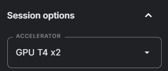

# Movie Review Sentiment Analysis

This project is a sentiment analysis model for movie reviews using **DistillBERT**. It aims to classify movie reviews as **positive** or **negative** based on the sentiment expressed in the text.

## Model Information

### Data
#### 1. Source
The dataset is from [**IMDB**](https://www.imdb.com/) (Internet Movie Database), a comprehensive online database of films, TV shows, and reviews. IMDB is widely recognized for its extensive movie ratings and critiques from both professional critics and a large community of movie enthusiasts.

#### 2. Data Pre-processing
- **Handling missing data:** Remove any incomplete entries to maintain data integrity.
- **Data normalization:**
  - Convert labels: **1** for **Positive** and **0** for **Negative** to streamline training.
  - **Remove HTML tags:** Using **BeautifulSoup** to clean unnecessary tags from text.
  - **Remove emojis:** Emojis add sentiment value but introduce inconsistencies in text processing. **Regular expressions (RE)** are used to filter them out.
- **Splitting data:**
  - **80%**: Training data
  - **16%**: Validation data
  - **4%**: Test data

### Model Performance

#### 1. Training Phase
The model is trained with **EarlyStoppingCallback = 3** and evaluated every 500 steps. Below are the key results:

|Step|Training Loss|Validation Loss|Accuracy|F1-score|
|:---:|:----------:|:-------------:|:------:|:------:|
|500|0.2996|0.2781|0.8958|0.8958|
|1000|0.2623|0.2763|0.8978|0.8977|
|1500|0.2519|0.2579|0.9050|0.9049|
|2000|0.2318|0.2506|0.9045|0.9044|
|2500|0.2382|0.2615|0.9031|0.9030|
|3000|0.1658|0.2886|0.9095|0.9095|
|3500|0.1700|0.3339|0.9069|0.9067|
|4000|0.1713|0.3051|0.9116|0.9116|
|4500|0.1691|0.2852|0.9031|0.9030|
|5000|0.1825|0.2443|0.9148|0.9147|
|5500|0.1069|0.3562|0.9148|0.9147|
|6000|0.1058|0.3747|0.9140|0.9140|
|6500|0.1076|0.3751|0.9071|0.9070|

## Running the Model

### 1. Running on Kaggle
You can use Kaggle's free GPU resources to train and test the model:

- Visit Kaggle: [Movie Review Sentiment Analysis](https://www.kaggle.com/code/hungdongne/movie-review-sentiment-analysis-using-distilbert)
- Click **"Copy & Edit"** on the upper right corner.
- In **Session Options**, enable **GPU** (recommended: **T4 x2** for better performance).
  
  
  
- Click **"Run All"** and wait (~30 minutes) for the training phase to complete.

### 2. Sentiment Analysis (Testing the Model)
Modify the last code cell with your own text input to predict sentiment. Example:

```bash
So hot today =_= don't like it and I hate my new timetable, having such a bad week
```

Run the cell (**Ctrl + Enter**) to get the sentiment prediction:

```bash
Negative
```

### 3. Running on Local VS Code
#### Installation
1. **Clone the repository:**
   ```bash
   git clone https://github.com/HungDongne/Movie-review-sentiment-analysis-by-using-DistillBERT.git
   ```

2. **Set up a virtual environment (recommended to prevent conflicts):**
   ```bash
   python -m venv .env
   ```

3. **Activate the environment:**
   - On Windows:
     ```bash
     .env\Scripts\activate
     ```
   - On macOS/Linux:
     ```bash
     source .env/bin/activate
     ```

4. **Install dependencies:**
   ```bash
   pip install -r requirements.txt
   ```

5. **Deactivate the environment when done:**
   ```bash
   deactivate
   ```

#### Usage
Run the script and modify the last cell to test with your own sentences.

## License
This project is licensed under the MIT License. Feel free to use and modify it for your needs!